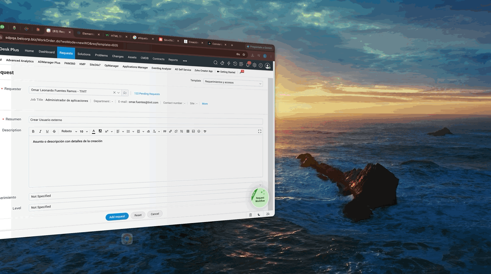

# Creación de Usuarios Externos

Para crear un usuario externo, debes diligenciar los siguientes campos:

  <h3>Campos para crear usuario externo: </h3>
  <ul class="sublist">
    <li>
      <strong>Template</strong>: Requerimientos y accesos
    </li>
    <li>
      <strong>Requester</strong>: Nombre del solicitante
    </li>
    <li>
      <strong>Tipo de Requerimiento</strong>: Gestión de Usuarios
    </li>
    <li>
      <strong>Gestión de Usuarios</strong>: Nuevo Colaborador
    </li>
    <li>
      <strong>Grupo</strong>: Aplicaciones
    </li>
    <li>
      <strong>Puesto</strong>: Externo
    </li>
    <li>
      <strong>Tipo de carga</strong>: Individual
    </li>
    <li>
      <strong>Datos del Usuario</strong>: Diligenciar los marcados con
      *
    </li>
    <li>
      <strong>País</strong>: Elegir entre los permitidos
    </li>
  </ul>

Una vez el ticket es creado, debe pasar por revisión de controller y él aprueba el ticket
para ser resuelto y elige el grupo de resolutor para que la automatización inicie.
