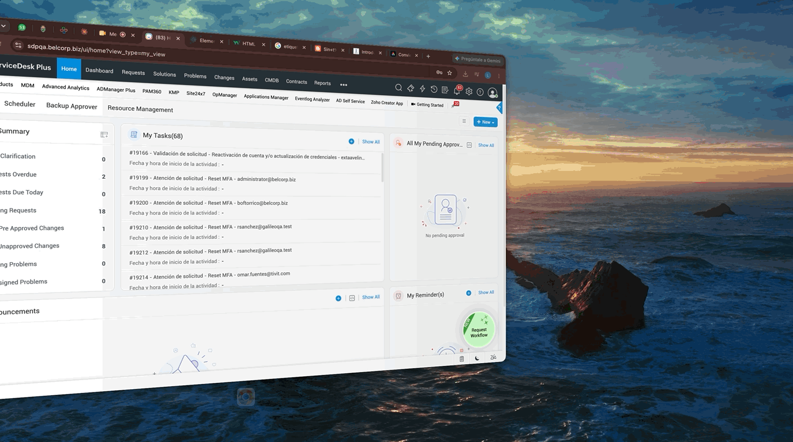

# Introducción

Tutorial básico para hacer un ticket en SDP para las automatizaciones **NextGEN**.

## Empecemos

Bienvenido :wave: al **Manual de automatizaciones**. Esta es una guía básica con la cual podrás
crear tickets en SDP.

Todos los tickets se crean a través del botón **request**, como se puede ver en el siguiente gif.

Una vez escribas el asunto podrás crear un ticket para las siguientes automatizaciones:

  <h3>Automatizaciones NextGEN</h3>
  <ul class="sublist">
    <li>Creación de usuarios externos</li>
    <li>Creación de usuarios genéricos</li>
    <li>Reset MFA</li>
    <li>Añadir/quitar grupos</li>
    <li>Password/expiration</li>
    <li>Tableau</li>
    <li>Snowflake</li>
    <li>Github -Agregar usuarios a repo</li>
    <li>Github - Crear Repo</li>
    <li>Generar AMI Backup</li>
    <li>Generar Snapshot Backup</li>
    <li>PDP SICC</li>
    <li>Encendido/apagado de ambientes</li>
  </ul>

